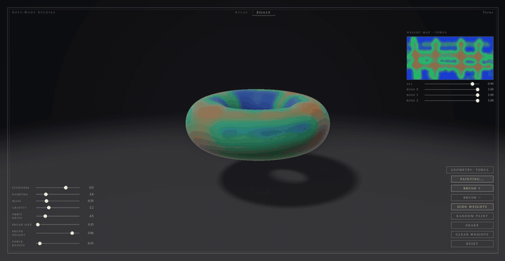

# A Jiggle Physics Standard - Xlovecam

<p align="center">
  
</p>


**A reference standard for real-time jiggle physics** by **xlovecam** — how to
paint soft regions, drive damped spring bones, and deform meshes consistently
across engines.

> Not ragdoll. Not cloth. Not full soft-body FEM.  
> Paint weight on a UV map, drive randomized spring bones from parent motion,  
> one rule: `vertex += weight * boneJiggle`.

**Author: [xlovecam](https://github.com/xloveee)**

No build step. Open `index.html` in any WebGL-capable browser.

---

## Also known as

Spring bones · jiggle bones · soft-body secondary motion · weight-painted physics ·
vertex weight jiggle · Blender-style flesh bounce · mesh wobble · damped spring
deformation · parent-velocity lag · orbit-driven bounce

---

## The standard

Two pieces, one contract:

| Piece | What it is |
| --- | --- |
| **Weight map** | Per-region softness in `[0, 1]`, painted on a UV texture (one weight per vertex in a real engine). |
| **Jiggle bones** | A small set of damped springs; each painted region follows one bone. Seeded frequency/damping so regions wobble **out of sync**. |

The entire deformation (a texel may follow more than one bone):

```glsl
vertex += Σ_b weight_b * offset_b;
```

Each bone is a damped oscillator in the parent's accelerating frame:

```
x'' = -ω² x - 2ζω x' - a_parent + g
```

`ω` and `ζ` are the shared tissue response scaled by the bone's region size
(`ω ∝ 1/√size`, see below), so a wide painted band and a small dot on the same
material move differently, as they do on a body.

The reference step is the **exact closed-form solution** of that equation, so
it is stable for any `dt` and defines the output rather than approximating it.
Two conforming engines agree to floating-point precision.

In this demo (SDF ray-marcher), the equivalent samples the base shape at
`q - offset`, with asymmetric squash & stretch along the motion vector
(trailing bulge, leading flatten). That styling is the renderer's, not the standard's.

The portable asset is **`weightmap.png` + seed**. The PNG is lossless RGBA
(RFC 2083): R / G / B are the three bone channels. The seed reproduces the
per-bone character. Together they fully describe a look.

---

## Architecture

The **engine**, its **extensions**, the **weight map**, and the **renderers**
are separate by design. `jiggle-physics.js` does the math only — no DOM, no
WebGL — so you can drop it into any renderer. Extensions never alter the step.
Three demos (1D / 2D / 3D) share the same engine files and link to each other
from a nav at the top of each page.

```
jiggle/
├── index.html           # 3D demo: markup, styles, GLSL shader
├── demo-1d.html         # 1D demo: three damping regimes, exact step at any rate
├── demo-2d.html         # 2D demo: edge-bone presets per geometry, colliders
├── jiggle-physics.js    # core: exact damped-spring step (no DOM, no WebGL)
├── jiggle-colliders.js  # extension: plane / sphere / capsule projection
├── jiggle-chain.js      # extension: linked bones (tail, hair, antenna)
├── jiggle-weightmap.js  # 3D: UV paint, force blur, PNG export/import
├── jiggle-app.js        # 3D: WebGL renderer (engine + colliders + weight map)
├── jiggle-demo-1d.js    # 1D: Canvas renderer
├── jiggle-demo-2d.js    # 2D: Canvas renderer (engine + colliders)
├── jiggle-demo.css      # shared chrome for the 1D / 2D pages
└── asset/
    └── jiggle-physics-demo.gif
```

### `jiggle-physics.js` — simulation engine

`createJigglePhysics({ bones: 3, seed: 1 })` — drop into any game loop.

- **No DOM, no WebGL** — renderer-agnostic; all WebGL lives in the demo, not the engine.
- Input is the parent **acceleration** `[ax, ay, az]` in the shape's frame — the
  only external term a spring in an accelerating frame feels. Hosts with only a
  position use `createJiggleDriver()` (finite difference + smoothing).
- Parameters are the observable pair: `freq` (Hz) and `damp` (damping ratio ζ),
  plus `g` (gravity). Absolute mass is not a parameter — it is not observable
  separately from `k/m` and `c/m`. ζ ≥ 1 (critical / over-damped) is handled.
- **Relative** mass is observable and is per bone: `bones[i].size` (default 1)
  is the mass of the region the bone stands for. Tissue `k` and `c` are shared,
  so `ω` and `ζ` both scale by `1/√size` — a larger region wobbles slower, rings
  longer and travels further. The demos derive `size` from the painted area
  (Σ weight / texel count, exposed as `weights.area[i]`), clamped to
  `[0.5, 2]` because UV area is only a proxy for surface area.
- Per-bone character is seeded (mulberry32): frequency, damping and gravity
  multipliers. `reseed()` / `reseed(n)` and `shake()` use the same RNG — no
  `Math.random()` in the engine.
- The step is the closed-form damped-oscillator solution; no fixed timestep,
  no substeps, no accumulator.
- Returns bone offsets each frame:

```javascript
const physics = createJigglePhysics({ bones: 3, seed: 1 });
const offsets = physics.update(dt, parentAcceleration);  // [ax, ay, az]
// Float32Array [x0,y0,z0, x1,y1,z1, ...]
```

### `jiggle-colliders.js` — collisions (extension)

Constraint projection after the exact step: each bone is pushed out of any
collider along the surface normal and the velocity component into the surface
is removed (restitution optional). Exact between contacts, a discrete event at
contact — the scheme production spring-bone systems use. `limit` confines the
offset to a sphere around its rest point (the 3D demo's ray-march guard).

```javascript
const col = createJiggleColliders({ limit: 0.4, restitution: 0 });
const floor = col.plane(0, 1, 0, -1);          // n·p >= d, mutable {nx,ny,nz,d}
const ball  = col.sphere(1, 0, 0, 0.5);        // keep out, mutable {cx,cy,cz,r}
col.capsule(ax, ay, az, bx, by, bz, r);
col.resolveAll(physics, bx, by, bz);           // world = rest point + offset
```

A bone is a point mass standing in for a region, so this models "region hits a
surface". Mesh-vs-mesh self-collision is cloth/FEM territory and stays out.

### `jiggle-chain.js` — linked bones (extension)

Link *i* hangs off link *i−1*. Each link takes the exact step; its input is the
root acceleration plus the acceleration of the link above it this frame.
Sequential, exact per link, no coupling forces.

```javascript
const chain = createJiggleChain({ links: 6, seed: 1 });
const tips = chain.update(dt, rootAccel);      // cumulative tip offsets
```

No demo page uses the chain; it is a library extension for hosts with tails or
hair. Springs *between* bones would make the system coupled and break the
single-oscillator closed form; that is deliberately not part of the standard.

### `jiggle-weightmap.js` — the portable weight asset

512×256 RGBA paint buffer, Smart-UV projection, force-radius blur, heatmap, and
PNG export / import. The demo's host owns sliders and keys; this file owns the
texels.

### `jiggle-app.js` — the WebGL demo renderer

This is one example renderer, not part of the engine. It owns the WebGL setup,
orbit camera, controls, and render loop. Each frame it accumulates a virtual
parent position from orbit / move / walk, turns it into acceleration with the
driver, feeds the engine, clamps the offsets for ray-march safety, and uploads
them + the weight textures to the shader.

### `index.html` — the 3D reference scene

Five test geometries with demo presets, weight heatmap, physics sliders, and a
2D UV paint window. Offsets are confined to 0.4 and collide with the ground
plane at `y = −1`; shift-drag the orb into the floor and the painted belly
squashes upward.

### `demo-1d.html` — the equation, visibly

Drag a handle; three masses with identical frequency follow at ζ = 0.14 / 1 /
1.7 (under-, critically-, over-damped) with scrolling traces. The **step rate**
slider throttles how often the engine is stepped: the curves keep their shape
because the step is exact, only the sample density changes.

### `demo-2d.html` — edge bones and colliders on a Canvas

Same layout and controls as the 3D page. Cycle disc / capsule / ring (`G`);
each carries a preset of three bones on its outline, mirroring the orb /
capsule / torus presets. The outline follows them (`point += Σ_b w_b · offset_b`)
and is tinted by the bone it follows; `W` shows the bones as rest ring → offset
dot. A floor plane and a draggable ring are colliders; the **drive** slider
scales how hard dragging accelerates the bones.

---

## Weight painting

Weights live in a **512×256 RGBA texture** (R / G / B = three jiggle bones).
Each geometry uses a **Smart-UV-style projection** so paint maps cleanly to the
surface:

| Geometry | Projection |
| --- | --- |
| Orb | Sphere (equirectangular) |
| Capsule | Cylinder along Y |
| Torus | Major ring U + tube V |
| Air dancer | Cylinder along swaying centreline |
| Walker | Cylinder, seam at back |

Paint in the **2D UV map panel** (not on the 3D viewport). One texture lookup
per sample — no brush cap, no per-step cost scaling.

Export (`E`) writes `jiggle-weights-seed-<seed>.png`. Import (`I`) loads a PNG
into the paint buffer; if the filename contains `seed-<n>`, the engine reseeds
so the look matches.

### Controls

| Input | Action |
| --- | --- |
| **`P`** | Paint mode — UV map panel appears |
| Paint in UV window | Add weight (Blender-style flow build-up) |
| **`+` / `−`** | Add / erase brush |
| **`W`** | Toggle weight heatmap (blue = anchored → red = soft) |
| **`G`** | Cycle geometry |
| **`C`** | Clear weights |
| **`X`** | Random paint |
| **`E`** | Export weight map PNG |
| **`I`** | Import weight map PNG |
| **`Space`** | Shake |
| **`R`** | Reset camera |
| Drag | Orbit (drives jiggle) |
| Shift-drag | Move object (also drives jiggle) |
| Wheel | Zoom |

### Region strength sliders

Below the UV map — scale painted regions **after the fact** without re-painting:

- **all** — master gain on every painted region
- **bone 0 / 1 / 2** — per-channel gain (each stroke assigns a bone in rotation)

### Demo presets

Each geometry loads a preset weight map on switch (`G`) that showcases the
standard with multiple out-of-sync bones:

- **Orb** — heavy sagging bottom + softer equatorial band
- **Capsule** — heavy hanging bottom cap + mid belly
- **Torus** — three lobes evenly spaced on the outer rim
- **Air dancer** — head-heavy stacked rings, feet anchored
- **Walker** — soft bust, glutes, groin

---

## Physics sliders

| Slider | Parameter |
| --- | --- |
| frequency | natural frequency `ω / 2π` in Hz |
| damping | damping ratio `ζ` (1 = critical) |
| gravity | sag under gravity (acceleration) |
| orbit drive | host-side gain: how hard camera orbit drives the parent position |
| brush size | UV paint radius |
| brush weight | paint target strength |
| force radius | jiggle spread from painted regions |

---

## Integration

```javascript
const physics = createJigglePhysics({ bones: 3, seed: 1 });
const driver = createJiggleDriver();     // only if you have position, not acceleration

// each frame: parent acceleration in the shape's frame
const accel = driver.update(dt, [x, y, z]);   // or your engine's own value
const offsets = physics.update(dt, accel);

// optional: colliders after the step, before reading offsets
colliders.resolveAll(physics, restX, restY, restZ);

// per vertex in your mesh:
const w = sampleWeights(vertex.uv);      // RGB = weight per bone (0..1)
vertex.position += w.r * bone(0) + w.g * bone(1) + w.b * bone(2);
```

The weight map PNG and the seed are the portable assets. The physics engine
is the portable simulation. Any renderer that can multiply and add vectors can
implement the standard.

---

## Running locally

```bash
open index.html
# or serve statically:
python3 -m http.server 8080
```

## License

Use freely. Please attribute **xlovecam** and link to
[github.com/xloveee/jiggle-physics](https://github.com/xloveee/jiggle-physics)
if you ship this standard in a project.
